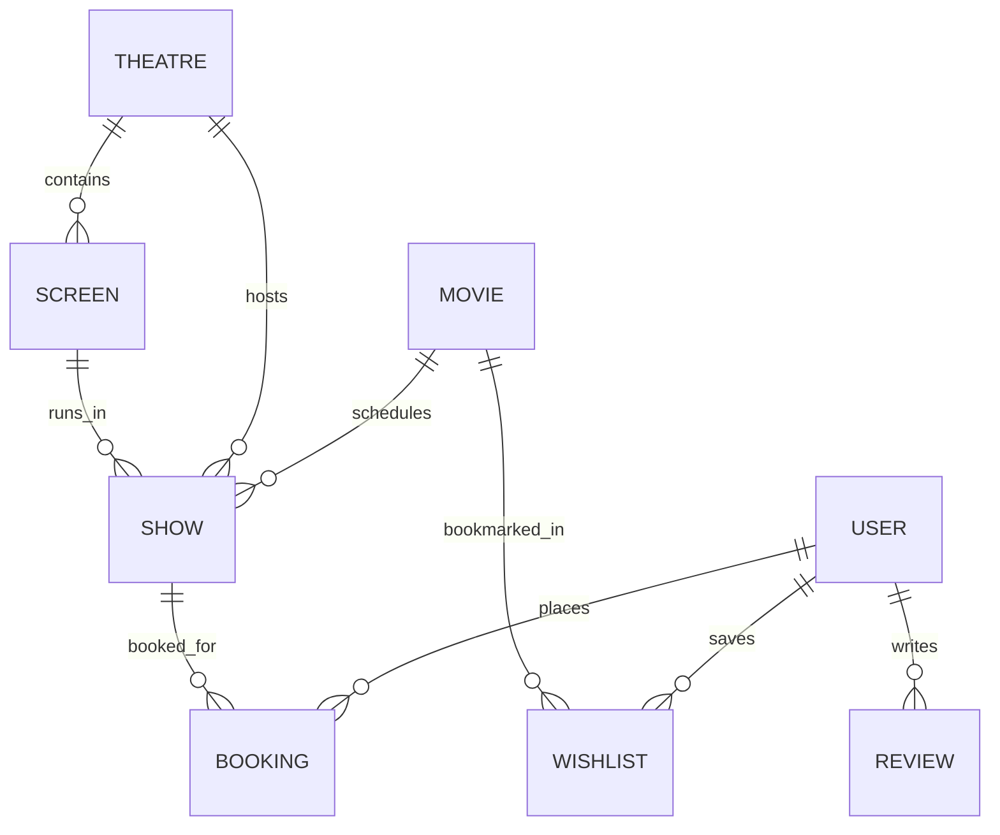

# 🎬 MovieVerse Pro — Full-Stack MERN Movie Ticketing Platform

> A production-grade, BookMyShow-inspired movie ticket booking platform built with **React 19**, **Vite**, **Express.js**, **Node.js**, **MongoDB**, **Mongoose**, and **JWT Authentication**.

---

## 🌟 Project Overview

**MovieVerse Pro** is designed to demonstrate industry-standard full-stack web development principles for software engineering portfolios and technical interviews. It incorporates clean MVC architecture, stateless JWT session security, real-time reactive seat booking matrices, and MongoDB aggregation analytics.

---

## 🚀 Technology Stack

### **Frontend**
- **Framework**: React 19 + Vite
- **Routing**: React Router DOM (v6)
- **State Management**: React Context API (`AuthContext`)
- **HTTP Client**: Axios with custom Bearer token request interceptors
- **Styling**: Pure Vanilla CSS (CSS variables, Flexbox, CSS Grid, Glassmorphism, CSS Shimmer Loading Animations)

### **Backend**
- **Runtime**: Node.js
- **Server Framework**: Express.js
- **Database**: MongoDB (Mongoose ODM)
- **Authentication**: JSON Web Token (`jsonwebtoken`) & Password Hashing (`bcryptjs`)
- **Architecture**: Model-View-Controller (MVC)

---

## 📁 Project Architecture & Folder Structure

```text
movieverse-pro/
├── client/
│   ├── src/
│   │   ├── components/       # Reusable UI (Navbar, Footer, MovieCard, MovieCarousel, SeatSelector, Skeleton)
│   │   ├── pages/            # Public, Protected User, and Admin Pages
│   │   ├── context/          # AuthContext.jsx (Global user session state)
│   │   ├── hooks/            # useAuth.js custom hook
│   │   ├── services/         # api.js (Axios HTTP client with JWT interceptors)
│   │   ├── utils/            # Helper functions
│   │   ├── css/              # Glassmorphic dark CSS design system
│   │   └── assets/           # Static assets
│   ├── package.json
│   └── vite.config.js
│
└── server/
    ├── config/               # db.js (Mongoose connection handler)
    ├── database/             # connectDB.js database connector module
    ├── controllers/          # Business logic controllers (auth, movie, show, booking, wishlist, review, admin)
    ├── middleware/           # authMiddleware.js & errorMiddleware.js
    ├── models/               # 8 Mongoose Schemas (User, Movie, Theatre, Screen, Show, Booking, Wishlist, Review)
    ├── routes/               # Express REST API routes
    ├── utils/                # generateToken.js (JWT helper)
    └── server.js             # Main server entry point
```

---

## 🗄️ Database Schemas & Object Relationships

The application enforces strict database relational integrity using Mongoose `ObjectId` references:



1. **`User`**: Stores credentials with bcrypt pre-save hashing and role flag (`user` | `admin`).
2. **`Movie`**: Catalog films with genres, language, duration, poster, trailer, and rating.
3. **`Theatre`**: Cinema venues mapped by city.
4. **`Screen`**: Auditorium capacity (Rows A–J x Columns 1–12 = 120 seats).
5. **`Show`**: Showtime entry linking `movieId`, `theatreId`, and `screenId` with `showDate`, `showTime`, and `ticketPrice`.
6. **`Booking`**: Ticket reservation linking `userId` and `showId` with `seats` array, `totalAmount`, and unique `MVP-XXXXXX` booking code.
7. **`Wishlist`**: User bookmarks with compound unique index on `(userId, movieId)`.
8. **`Review`**: User movie ratings (1–5 stars) and comments.

---

## 📡 REST API Reference

| Method | Endpoint | Access | Description |
| :--- | :--- | :--- | :--- |
| **POST** | `/api/auth/register` | Public | Register new user account |
| **POST** | `/api/auth/login` | Public | Authenticate user & issue JWT |
| **GET** | `/api/auth/profile` | Protected | Fetch current user profile |
| **PUT** | `/api/auth/profile` | Protected | Update profile or password |
| **GET** | `/api/movies` | Public | List catalog movies |
| **GET** | `/api/movies/:id` | Public | Get movie details |
| **POST** | `/api/movies` | Admin | Create catalog movie |
| **PUT** | `/api/movies/:id` | Admin | Update catalog movie |
| **DELETE**| `/api/movies/:id` | Admin | Delete movie entry |
| **GET** | `/api/shows/theatres` | Public | List theatre venues |
| **POST** | `/api/shows/theatres` | Admin | Add new theatre venue |
| **GET** | `/api/shows/movie/:movieId` | Public | Fetch showtimes for a movie |
| **POST** | `/api/shows` | Admin | Schedule a showtime |
| **GET** | `/api/bookings/show/:showId/booked-seats` | Public | Fetch booked seat IDs |
| **POST** | `/api/bookings` | Protected | Create booking (with `$in` concurrency check) |
| **GET** | `/api/bookings/my-bookings` | Protected | Fetch user booking history |
| **POST** | `/api/wishlist` | Protected | Bookmark movie |
| **GET** | `/api/wishlist` | Protected | Get user wishlist |
| **DELETE**| `/api/wishlist/:movieId` | Protected | Remove bookmark |
| **GET** | `/api/admin/stats` | Admin | Aggregate dashboard analytics |

---

## ⚡ Installation & Setup Guide

### 1. Clone Repository & Install Dependencies
```bash
# Clone repository
git clone https://github.com/your-username/movieverse-pro.git
cd movieverse-pro

# Install Backend Dependencies
cd server
npm install

# Install Frontend Dependencies
cd ../client
npm install
```

### 2. Environment Variables Configuration
Create a `.env` file in the `server` directory:
```env
PORT=5000
MONGO_URI=mongodb://localhost:27017/movieverse_pro
JWT_SECRET=movieverse_super_secret_jwt_key_2026_interview_ready
NODE_ENV=development
```

Create a `.env` file in the `client` directory:
```env
VITE_API_BASE_URL=http://localhost:5000/api
```

### 3. Start Development Servers
```bash
# Terminal 1: Start Node/Express Server
cd server
npm run dev

# Terminal 2: Start Vite React Dev Server
cd client
npm run dev
```

---

## 💡 Key Architectural Concepts for Technical Interviews

### 1. **How JWT Authentication & Persistent Sessions Work**
- **Token Signing**: On login or registration, Node signs a JWT payload containing `userId` and `role`.
- **Axios Interceptor**: The frontend custom Axios instance (`client/src/services/api.js`) automatically reads `localStorage.getItem('token')` and injects `Authorization: Bearer <token>` header into every outgoing HTTP request.
- **Session Rehydration**: On application mount, `AuthContext` makes a request to `/api/auth/me`. If valid, session state is automatically restored without requiring re-login.

### 2. **MongoDB Aggregation Pipelines (`$group`, `$sum`, `$lookup`)**
The `adminController.js` uses advanced MongoDB aggregation pipelines to calculate metrics:
```javascript
Booking.aggregate([
  {
    $lookup: {
      from: 'shows',
      localField: 'showId',
      foreignField: '_id',
      as: 'show'
    }
  },
  { $unwind: '$show' },
  {
    $lookup: {
      from: 'movies',
      localField: 'show.movieId',
      foreignField: '_id',
      as: 'movie'
    }
  },
  { $unwind: '$movie' },
  {
    $group: {
      _id: '$movie._id',
      title: { $first: '$movie.title' },
      ticketsSold: { $sum: { $size: '$seats' } },
      totalRevenue: { $sum: '$totalAmount' }
    }
  },
  { $sort: { ticketsSold: -1 } },
  { $limit: 1 }
]);
```

### 3. **Seat Concurrency Control without Race Conditions**
To prevent two users from booking the same seat simultaneously without Socket.io overhead, `bookingController.js` uses MongoDB `$in` operator:
```javascript
const existingBookings = await Booking.find({ showId });
const currentlyBookedSeats = existingBookings.flatMap(b => b.seats);

const hasConflict = seats.some(seat => currentlyBookedSeats.includes(seat));
if (hasConflict) {
  return res.status(400).json({ success: false, message: 'Seats already booked!' });
}
```

---

## 📄 License & Attribution
Built for Software Engineering Portfolio & Interview Readiness. Open source under the MIT License.
